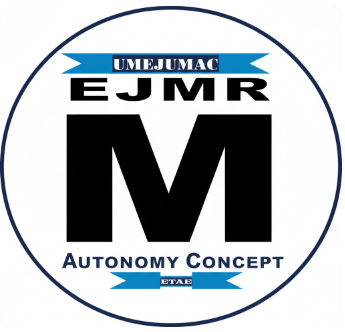

<!DOCTYPE html>
<html lang="es">
<head>
    <meta charset="UTF-8">
    <meta name="viewport" content="width=device-width, initial-scale=1.0">
    <title>UMEJUMAC | Soluciones Integrales y Digitales</title>
    
    
</head>
<body>

    <header>
        

            
        

        

            <h1>UMEJUMAC</h1>
            
Soluciones Integrales y Digitales.

        

    </header>

    <nav class="main-nav">
        

            <ul>
                <li><a href="#consultoria">Consultoría</a></li>
                <li><a href="#servicios">Servicios</a></li>
                <li><a href="#ventas">Venta de Bienes</a></li>
                <li><a href="#portafolio-cv">Portafolio/CV</a></li>
                <li><a href="https://umejumac.blogspot.com/?zx=d20becec4ee219d9" target="_blank">Blog</a></li>
            </ul>
        

    </nav>

    <main class="container">

        <section style="text-align: center; padding: 40px 0;">
            <h2>Nuestros Pilares de Servicio y Negocio</h2>
            
Acceda a nuestra experiencia en salud, servicios profesionales y catálogo de bienes.

        </section>

        

            
            

                
1. Consultoría en Salud Colectiva

                

                    
Ofrecemos consultoría especializada en gestión de riesgos, epidemiología y diseño de políticas de bienestar social y corporativo. Este espacio permite documentar el material de trabajo, capacitación y resultados.

                    
                    <h3>Material de Capacitación y Documentación</h3>
                    
Nuestros módulos de capacitación incluyen **Planificación Estratégica y Marco Lógico** aplicados al sector salud. Además, ofrecemos soporte en la **elaboración de diagnósticos situacionales de salud** y **proyectos**.

                    
                    <ul>
                        <li>Análisis Estratégico de Riesgos.</li>
                        <li>Diseño de Planes de Prevención.</li>
                        <li>Documentación de Reuniones de Trabajo.</li>
                    </ul>

                    <h3>Galería de Reuniones y Resultados (Rutas Ficticias)</h3>
                    

                        
                        
                    

                

            

            

                
2. Servicios Profesionales y Soluciones Tecnológicas

                

                    
Accede a la experiencia legal, administrativa y de desarrollo de software a medida. Somos tu socio en la transformación digital y la gestión empresarial.

                    
                    <h3>Servicios Ofrecidos</h3>
                    
Contamos con profesionales capacitados para la asesoría legal en el área de **Medicina Legal** y **Derecho Penal**, además de experiencia en **Psicocriminología**. Ofrecemos consultoría en **políticas de salud** y sus aspectos jurídicos.

                    
                    <ul>
                        <li>Desarrollo Web Personalizado y E-commerce.</li>
                        <li>Asesoría Legal y Administrativa.</li>
                        <li>Implementación de Software de Gestión y Análisis de Datos.</li>
                    </ul>

                    <h3>Portafolio de Proyectos Recientes (Rutas Ficticias)</h3>
                    

                        
                        
                    

                

            

        

        
        <section id="ventas">
            <h2>3. Venta de Bienes</h2>
            
Instrumental médico, equipos de ejercicio, textos de Derecho y más. ¡Contáctanos para más detalles!

            

                

                    
                    

                        <h3>Instrumental Quirúrgico Médico (Varios)</h3>
                        
Bandeja de instrumental con pinzas, tijeras, escalpelo y accesorios. Ideal para consultorios u hospitales. Acero inoxidable.

                        Precio: A consultar
                    

                

                
                

                    
                    

                        <h3>Set de Especulos Metálicos (Varios Tamaños)</h3>
                        
Lote de especulos vaginales de metal en diferentes tamaños y modelos. En excelente estado para esterilización y uso.

                        Precio: A consultar
                    

                

                

                    
                    

                        <h3>Fórceps Obstétrico de Acero</h3>
                        
Instrumento médico especializado. Fórceps obstétrico en acero de alta calidad. Mantenimiento y esterilización óptimos.

                        Precio: A consultar
                    

                

                

                    
                    

                        <h3>Juego de Cavas Térmicas (Grande y Pequeña)</h3>
                        
Dos cavas/gaveras de color rojo. Ideales para transporte de medicinas o alimentos refrigerados. Capacidad media y grande.

                        Precio: $XX USD (Juego)
                    

                

                
                

                    
                    

                        <h3>Máquina de Ejercicios y Levantamiento de Pesas</h3>
                        
Equipo de gimnasio multifuncional para entrenamiento de pecho y espalda. Estructura robusta y funcional.

                        Precio: $XXX USD
                    

                

                
                

                    
                    

                        <h3>Guadaña / Desmalezadora a Motor</h3>
                        
Equipo de jardinería y mantenimiento de áreas verdes. Funcionamiento a gasolina, con manillar ajustable.

                        Precio: $XXX USD
                    

                

                
                

                    
                    

                        <h3>Lote de Textos y Cursos de Derecho</h3>
                        
Colección variada de libros: Derecho Mercantil (4 tomos), Curso de Obligaciones (2 tomos), Derecho Civil I, II y IV, y Derecho Romano. Ideal para estudiantes o profesionales del Derecho.

                        Precio: A consultar (Lote o Individual)
                    

                

            

        </section>
        
        <section id="portafolio-cv">
            <h1 style="text-align: center;">Portafolio / Curriculum Vitae</h1>
            <h1 style="text-align: center;">Dr. José Gregorio Morales</h1>
            

            <h2>Información de Contacto</h2>
            

                
<strong>Nacionalidad:</strong> Venezolano

                
<strong>Organización:</strong> Universidad de los Andes, Mérida, Venezuela.

                
<strong>Correo electrónico:</strong> <a href="mailto:jgm963@gmail.com">jgm963@gmail.com</a> | <a href="mailto:jgm963@Outlook.com">jgm963@Outlook.com</a>

                
<strong>Teléfonos Celulares:</strong> +(58) 426 570 83 69 y + (58) 412 693 83 69

            

            <h2>Educación</h2>
            <ul class="cv-list">
                <li>**Doctor en Gestión para la Creación Intelectual** (Universidad Politécnica Territorial del Estado Mérida, 2022).</li>
                <li>**Magister Scientiae en Salud Pública** (Universidad de los Andes, 2011).</li>
                <li>**Abogado *Magna Cum Laude*** (Universidad de los Andes, 2006).</li>
                <li>**Especialista en Administración en Salud Pública** (Universidad de los Andes, 1993).</li>
                <li>**Especialista en Obstetricia y Ginecología** (Hospital Universitario de los Andes, 1987).</li>
                <li>**Médico Cirujano** (Universidad Central de Venezuela, 1983).</li>
                <li>**Diplomado en Docencia en Seguridad Ciudadana y Seguridad Penitenciaria** (Universidad Nacional Experimental de la Seguridad, 2016).</li>
            </ul>

            <h2>Resumen de Experiencia</h2>
            
            <h3>Docencia Universitaria (1993 - Presente)</h3>
            <ul class="cv-list">
                <li>**Profesor Contratado en Medicina Preventiva y Social** en la Facultad de Medicina de la Universidad de los Andes desde 1993.</li>
                <li>**Profesor invitado** en la Facultad de Ciencias Jurídicas y Políticas (Derecho Penal y Medicina Legal) y en la Escuela de Criminalística (Psicocriminología).</li>
                <li>**Coordinador General** del núcleo de pregrado en Medicina de la UNIVERSIDAD NACIONAL EXPERIMENTAL “RÓMULO GALLEGO” en Mérida.</li>
                <li>**Apoyo Docente** en clases magistrales en políticas de salud y sus aspectos jurídicos, en postgrados de Gestión en salud pública y Epidemiologia del Instituto de Altos Estudios Arnaldo Gabaldón.</li>
                <li>**Logro Destacado:** Aporte a la formación profesional en pregrado y postgrado, conjugando conocimientos adquiridos en la medicina y el derecho.</li>
            </ul>

            <h3>Cargos Directivos y Asesoría en Salud Pública</h3>
            <ul class="cv-list">
                <li>**Asesor en materia de salud** del Despacho de Gobernación del Estado Bolivariano de Mérida (Ene - Nov 2021).</li>
                <li>**Director General** de la Corporación de Salud del Estado Bolivariano de Mérida (2019 - Oct 2020).</li>
                <li>**Director de Gestión Médica Administrativa** de la Corporación de Salud del Estado Mérida (2017 - 2018).</li>
                <li>**Coordinador Estadal de Fortalecimiento Institucional** en el PROYECTO SALUD (Convenio BID), con la obligación de ser la contraparte en el Estado para recuperar infraestructura y capacitar al equipo de salud y comunidades (Abr 1997 - Ene 1999).</li>
                <li>**Director de Hospitales y Coordinador de Programas Prioritarios** (1988 - 2016), incluyendo Director del Hospital II El Vigía y Coordinador Regional de Atención Materna, Planificación Familiar y Oncología.</li>
                <li>**Logro Destacado:** Los logros alcanzados como director y coordinador se expresan en atención en salud y mayor calidad de vida en las poblaciones objetivos.</li>
            </ul>

            <h2>Sociedades a las que Pertenece</h2>
            <ul class="cv-list">
                <li>Miembro Activo del Colegio Médico del Estado Mérida (Matrícula N° 1776).</li>
                <li>Miembro Activo de la Federación Médica Venezolana.</li>
                <li>Miembro Activo del Colegio de Abogados del Estado Mérida (Matrícula N° 6690).</li>
                <li>Miembro Activo de la Sociedad Venezolana de Obstetricia y Ginecología, designado como integrante de la Sección de Medicina Legal.</li>
                <li>Miembro Activo del Instituto de Previsión Social del Médico (INPRES).</li>
            </ul>
        </section>

    </main>

    <footer>
        

            
Contáctanos: <a href="mailto:jgm963@gmail.com" style="color: white; text-decoration: underline;">jgm963@gmail.com</a> | Telf: +(58) 426 570 83 69

            
&copy; 2025 UMEJUMAC. Todos los derechos reservados.

        

    </footer>

</body>
</html>
